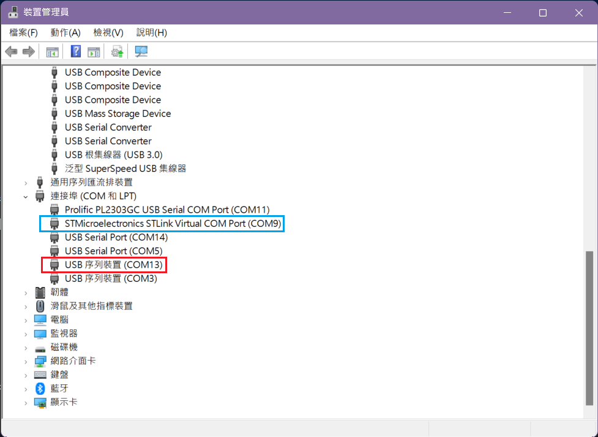

# NUCLEO-H755ZI-Q TCP Echo Server

## 硬體連接方式

1. NUCLEO-H755ZI-Q 板子上位於 CN1 的 USB-Micro 接到電腦
2. NUCLEO-H755ZI-Q USB-OTG (CN13: User USB connector) 連接到電腦的 USB

## 步驟

1. 編譯專案 CM4 和 CM7，並下載這兩個程式到版子上
2. 確認 Windows 裝置管理員，當板子重啟後，會多出一個 USB 序列裝置，如下圖紅框處，藍圈則是板子上的 STLink 提供的 COM Port，跟 USB-OTG 沒有關係

3. PuTTY 上設定 serial 如下圖，注意 Speed (baud rate) 設定，這裡設定 115200，但其實使用任何速度都可以

## 問題除錯

若以上步驟都沒出錯，則在 putty 視窗中輸入一個字元後，板子會傳回此字元的 ascii code + 2 後的字元，例如輸入 'a' 會傳回 'c'，輸入 '1' 傳回 '3'，以此推類。

如果裝置管理員只顯示 STMicroelectronics STLink Virtual COM Port，卻沒多出一個 USB 序列裝置，有以下方式除錯

- 確認板子綠色 LED (LD1)，若 LD1 有在閃表示程式正常運作
- 確認 micro-usb 線材沒有問題

韌體對應 CubeMX 6.6.1，目前在 6.7.0 無法運作，請不要 migrate 到 6.7.0